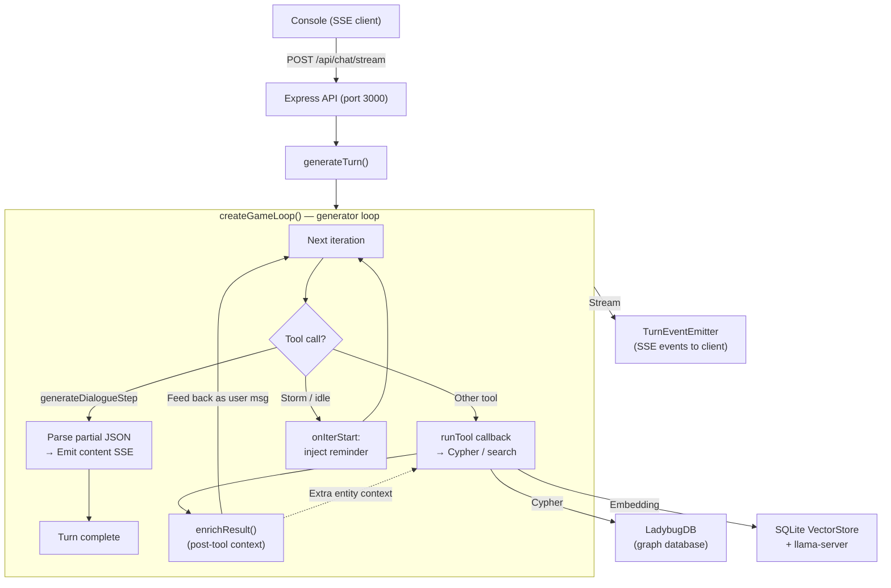

# Chorus — Developer Guide

Cinematic dialogue engine with branching paths, skill checks, and LLM Game Master.
**Stack:** TypeScript, Express, LadybugDB (graph), SQLite (vectors), DeepSeek SDK (custom, no AI SDK dependency).

---

## Project Overview

Chorus is a cinematic dialogue engine — an AI Game Master that generates branching narrative via LLM tool-calling, streamed to an interactive terminal client through SSE. The LLM uses a LadybugDB (Cypher) database to read/write world state (characters, locations, objects, plots, notes, dispositions). Hybrid search (dense + BM25 + optional cross-encoder reranking) runs locally via llama-server.

## Commands

```bash
npm run server            # Start Express server (port 3000)
npm run server:dev        # Start server with watch mode
npm run console           # Start interactive terminal client

npm run lint              # eslint . && tsc --noEmit
npm run format            # Format source (prettier)
npm run format:check      # Check formatting

npm run test              # All tests (vitest run, fileParallelism: false)
npm run test:watch        # Tests in watch mode
npm run test:unit         # tests/unit/
npm run test:integration  # tests/integration/
npm run test:scenarios    # tests/scenarios/
```

Single test:
```bash
npx vitest run tests/integration/tools.test.ts
```

---

## Architecture

### Two-process model

**Server** (`src/server/`) — Express API (port default 3000, configurable via `CHORUS_PORT`). Serves JSON API and SSE — no static file middleware. Manages the LadybugDB graph database, vector store (better-sqlite3), LLM orchestration via custom DeepSeek SDK, and SSE event streaming.

**Console** (`src/console/`) — Interactive terminal client using `@inquirer/prompts`. Connects to server via SSE, renders markdown with chalk colors. Supports resume from saved game state.

### Data flow



### SDK turn loop

`generateTurn()` calls `createGameLoop()` — a generator-based turn loop:

- **Generator loop**: Yields `LoopEvent` objects (tool_call, content_delta, usage, complete, error). Caller iterates via `for await` dispatching events to SSE.
- **ImmutablePrefix**: System prompt + initial messages are wrapped in a prefix to enable prompt caching — the prefix hash is included in API requests so the provider only recomputes from the first differing token.
- **Tool definitions via bridge.ts**: The 10 tool files use the SDK's built-in `Tool<ZodSchema>` type, converted to `ToolSpec` (OpenAI-compatible JSON Schema) via `toolToSpec()`. Zod v4 provides native `toJSONSchema()`. No external AI SDK dependency.
- **Streaming dialogue**: Partial JSON from `generateDialogueStep` arguments is parsed via `partial-json` parser to emit progressive content events.
- **Nudge via `onIterStart`**: Injects reminder messages when the GM has been processing too many iterations without calling `generateDialogueStep`.
- **ContextManager**: Token estimation triggers automatic history folding at configurable thresholds.
- **Message healing**: Pipeline repairs malformed messages before sending to the API.
- **Cache diagnostics**: Exposes hit/miss tokens and estimated cost savings.
- **Debug logging**: `DEBUG_PRINT_LLM_GENERATIONS` prints full LLM I/O to server console with chalk syntax highlighting.

### LLM tool system

The GM is given 10 tools, each with a specific responsibility:

| Tool                   | Purpose                                                                                 |
|------------------------|-----------------------------------------------------------------------------------------|
| `queryWorld`           | Raw Cypher queries (multi-hop traversals, aggregations, bulk ops) with READ/WRITE split |
| `searchWorld`          | Hybrid vector + BM25 + optional rerank search                                           |
| `manageNode`           | Node UPSERT / DELETE with embedding updates and JSON partial merge                      |
| `manageRelationship`   | Relationship UPSERT (auto-detects create vs update, JSON partial merge)                 |
| `editNote`             | GM scratchpad notes (ABOUT_CHARACTER/OBJECT/LOCATION/SCENE/PLOT)                        |
| `editPlot`             | Story arc management with status lifecycle and conditions                               |
| `manageSchema`         | Register new node/rel types (must run before data insertion)                            |
| `getContext`           | One-shot context bundle (schema dump, entity summaries, relationship dump)              |
| `generateDialogueStep` | Streaming output: produces messages and dialogue options for the player                 |
| `manageScene`          | Scene transitions with time tracking, location/character changes                        |

### Tool result enrichment

After tool execution, results pass through `enrichResult()` (`src/server/llm/enrichment.ts`) which adds entity context and disposition data for `manageNode`, `manageRelationship`, `queryWorld`, and `searchWorld`. This gives the LLM richer situational awareness without extra API calls.

### File map

```
src/
├── console/                        # REPL client
│   ├── main.ts                     # Entry, SSE listener, chalk rendering, REPL loop
│   ├── SseClient.ts                # SSE stream parser
│   └── markdown.ts                 # Terminal markdown rendering
│
├── server/
│   ├── main.ts                     # Express entry (default port 3000)
│   ├── api.ts                      # Routes: /chat/stream, /history, /reset, /checkpoints, /game/current, /checkpoint/restore/:turnNumber, /debug/tools/*
│   ├── validation.ts               # Zod schemas for API input
│   │
│   ├── db/                         # Persistence (LadybugDB + SQLite)
│   │   ├── index.ts                # Database singleton facade (graph, vectors, schema, models)
│   │   ├── ladybug.ts              # LadybugDB client wrapper (Cypher queries)
│   │   ├── vectorstore.ts          # SQLite-backed vector store (brute-force cosine)
│   │   ├── schema.ts               # SchemaRegistry: node/rel DDL, embedding text, search helpers
│   │   ├── checkpoint.ts           # CheckpointManager: turn-level save/restore (file copy)
│   │   ├── idGenerator.ts          # Short ID generation (Feistel cipher + base62)
│   │   ├── utils.ts                # Time formatting (day/half-hour → human-readable)
│   │   └── models/                 # Domain models
│   │       ├── entities.ts         # EntityModel: Character/Object/Location CRUD + embedding
│   │       ├── plots.ts            # PlotModel: lifecycle, branching, flags, progression
│   │       ├── notes.ts            # NoteModel: GM notes with entity/scene/plot linking
│   │       ├── messages.ts         # MessageModel: GM turn message persistence
│   │       └── scene.ts            # SceneModel: scene lifecycle, log append, history, chaining
│   │
│   ├── search/                     # In-process hybrid vector search
│   │   ├── hybridSearch.ts         # 3-way RRF fusion (name dense + content dense + sparse)
│   │   ├── embedder.ts             # llama-server client (Qwen3-Embedding-0.6B)
│   │   ├── bm25.ts                 # BM25+ keyword scorer (English-only, no CJK)
│   │   ├── sparseEncoder.ts        # FNV-1a token hashing for sparse retrieval
│   │   └── reranker.ts             # Optional cross-encoder rerank (separate llama-server)
│   │
│   ├── llm/                        # Game Master AI
│   │   ├── index.ts                # generateTurn(): creates game loop, emits SSE, persists
│   │   ├── prompt.ts               # System prompt: toolbox, turn rhythm, memory, plots, Cypher cookbook
│   │   ├── events.ts               # TurnEventEmitter — SSE event emission
│   │   ├── sceneContext.ts          # Builds scene context, entity briefs, plot trees
│   │   ├── enrichment.ts           # Post-tool result enrichment (entity context injection)
│   │   ├── rollSkillCheck.ts       # 2d6 + stat vs difficulty resolution + condition evaluation
│   │   └── tools/                  # LLM tool implementations (10 tools + shared.ts)
│   │       ├── queryWorld.ts
│   │       ├── searchWorld.ts
│   │       ├── manageNode.ts
│   │       ├── manageRelationship.ts
│   │       ├── editNote.ts
│   │       ├── editPlot.ts
│   │       ├── manageSchema.ts
│   │       ├── getContext.ts
│   │       ├── generateDialogueStep.ts
│   │       ├── manageScene.ts
│   │       └── shared.ts           # wrapSafe, checkText (CJK filter), validateAndExecute
│   │
│   └── stories/                    # World seeding (TOML)
│       ├── index.ts                # Active story selection (currently express-cult)
│       ├── seed.ts                 # seedDatabase(): idempotent seed via domain models
│       ├── types.ts                # TOML format types
│       ├── glass-cage.toml         # Seed story: Glass Cage
│       └── express-cult.toml       # Seed story: Express Cult (active)
│
├── shared/                         # Shared constants & types
│   ├── constants.ts                # TOOL_NAMES, SKILL_NAMES, DEBUG_PRINT_LLM_GENERATIONS
│   ├── events.ts                   # SSE event type definitions
│   ├── sse.ts                      # SSE formatting helpers
│   ├── colors.ts                   # Chalk wrappers for console output
│   └── highlight.ts               # JSON/markdown syntax highlighting (cli-highlight)
│
├── sdk/                            # DeepSeek API SDK (replaces AI SDK providers)
│   ├── types.ts                    # Shared types: ChatMessage, ToolSpec, Usage, LoopEvent
│   ├── client.ts                   # DeepSeekClient — HTTP, auth, SSE parsing
│   ├── prefix.ts                   # ImmutablePrefix — cacheable request prefix
│   ├── log.ts                      # AppendOnlyLog — message history + JSONL persistence
│   ├── healing.ts                  # Message healing pipeline
│   ├── diagnostics.ts              # Cache telemetry
│   ├── context.ts                  # ContextManager — token estimation, fold decisions
│   ├── loop.ts                     # createGameLoop() — generator turn loop
│   ├── bridge.ts                   # Tool() → ToolSpec converter (Zod → JSON Schema)
│   └── index.ts                    # Re-exports
│
└── types/                          # Frontend types
    └── dialogue.ts                 # Message, DialogueOption
```

### Database: LadybugDB (not Neo4j)

This project uses **LadybugDB** (`@ladybugdb/core`), an embedded, schema-first, strongly-typed Cypher database. Critical differences from Neo4j:

- **Schema-first**: every node label and relationship type must be registered as a table (`CREATE NODE TABLE` / `CREATE REL TABLE`) before inserting data
- **No APOC**: use `CALL show_tables()`, `CALL show_xxx()` instead of `SHOW` commands
- **`id()` not `elementId()`**, **`label()` not `labels()`** (single label only), **`current_timestamp()` not `datetime()`**
- **Walk semantics** for pattern matching (repeated edges allowed). Use `TRAIL`/`ACYCLIC` path modifiers or `is_trail()`/`is_acyclic()` to constrain
- **Variable-length paths require upper bound** (defaults to 30)
- **`null = null` → `NULL`** (not `true`), use `IS NULL` / `IS NOT NULL`
- No `FOREACH` — use `UNWIND` instead
- No `REMOVE` — use `SET n.prop = NULL` to delete properties

The full Cypher cookbook is embedded in the system prompt at `src/server/llm/prompt.ts`. Read `CYPHER.md` for more details.

### Vector search pipeline

1. `llama-server` (port 8080) provides embeddings via `Qwen3-Embedding-0.6B`
2. Optionally, a second `llama-server` (port 8081) provides cross-encoder reranking via `Qwen3-Reranker-0.6B`
3. `VectorStore` (better-sqlite3) stores vectors locally with `(node_type, kind)` filtering
4. `HybridSearcher` fuses dense cosine + BM25+ via RRF (3-way: name dense, content dense, sparse), optionally reranks top candidates

### ID generation

Entity IDs use a Feistel cipher (32-bit) + base62 encoding to produce short, human-readable 4-character IDs (e.g., `"aB3k"`). An `:IdCounter` node in LadybugDB atomically increments counters for uniqueness. Used primarily for messages so the GM can reference them easily.

### Skill checks

The `rollSkillCheck.ts` module handles 2d6 + stat bonus vs. difficulty resolution. Condition expressions (from plot branching) are evaluated via a whitelisted character set + `Function` constructor — no `eval()`. Currently the system always succeeds (known TODO), pending a proper extension system.

### Story seeding

Stories are defined as TOML files in `src/server/stories/`. The active story is set in `src/server/stories/index.ts` (`ACTIVE_SEED_STORY`). Seeding populates the graph with characters, locations, objects, plots, notes, and relationships. The story's setting and tone descriptions are injected into the system prompt via template variables. Currently two stories: `glass-cage` and `express-cult` (active).

### Time representation

In-game time uses the formula `day * 48 + half_hour` (48 half-hours per day). Day 1 at 08:00 = `1 * 48 + 16 = 64`. Relationships have `created_at` (birth) and `valid_at` (death, NULL = still active) — never deleted, only ended.

### Test infrastructure

- Tests use temporary directories (`os.tmpdir()`), isolated LadybugDB + SQLite per test
- `tests/helpers.ts` provides `setupTestDb()`, `teardownTestDb()`, `resetDb()`, `exec()`
- Embedder stub (4-dimensional) used when llama-server is unavailable
- `fileParallelism: false` — tests run sequentially (shared global `Database` singleton)
- `testTimeout: 30000` — some integration tests need this for DB operations
- `tests/unit/sdk/` — unit tests for SDK modules (context, diagnostics, healing, log, prefix, usage)
- `tests/integration/sdk/loop.test.ts` — SDK loop integration tests
- `tests/integration/tools.test.ts` — comprehensive tests for all 10 LLM tools
- `tests/scenarios/` — scenario-level tests (planned, directory is empty)

### License

AGPLv3 — see header in source files.
