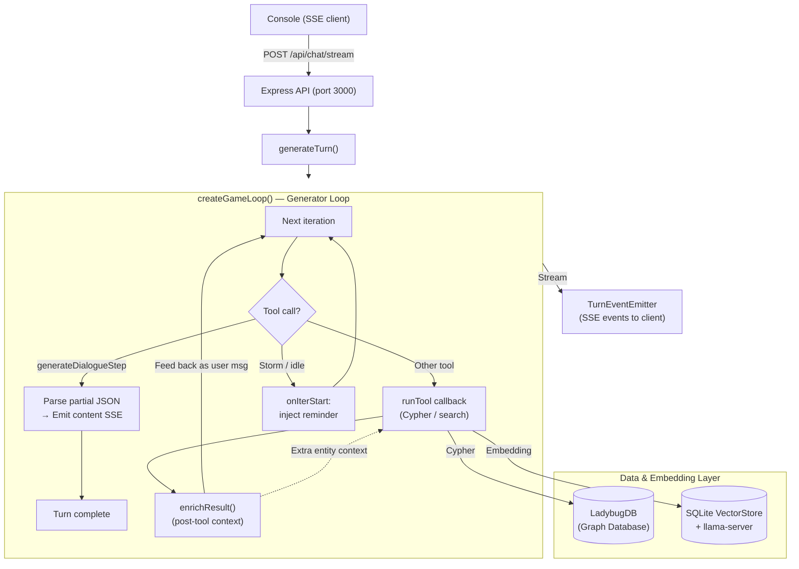

# Chorus — Developer Guide

Cinematic dialogue engine: AI Game Master generates branching narrative via LLM tool-calling, streamed to an interactive terminal over SSE.

**Stack:** TypeScript (ESM, `tsx` runner), Express, LadybugDB (embedded Cypher graph DB), SQLite via better-sqlite3 (vectors), custom DeepSeek SDK (`src/sdk/`), Zod v4 for tool schemas. No build step.

---

## Architecture (mermaid graph)



### How it works

**Two-process model** (or combined via `src/main.ts`):
- **Server** (`src/server/`) — Express API on port 3000. Manages LadybugDB, vector store, LLM orchestration, and SSE streaming.
- **Console** (`src/console/`) — Terminal REPL (`@inquirer/prompts`). SSE client with chalk + markdown rendering.

**Generator-based turn loop** (`createGameLoop()` in `src/sdk/loop.ts`):
- Yields `LoopEvent`s (content_delta, tool_call, usage, complete, error) — caller iterates via `for await` and dispatches to SSE.
- The LLM either emits dialogue via `generateDialogueStep` (partial JSON parsed → progressive SSE), or calls tools (Cypher, hybrid search, CRUD).
- **ImmutablePrefix** wraps system prompt + initial messages for prompt caching (prefix hash sent to API).
- **ContextManager** triggers history folding at configurable token thresholds.
- **Nudge** via `onIterStart` injects reminders when GM stalls without producing dialogue.
- **Message healing** repairs malformed messages before API calls.
- **Post-tool enrichment** (`enrichResult()`) injects entity context into tool results without extra API calls.

**10 LLM tools** (`src/server/llm/tools/`):

| Tool                   | Purpose                                                    |
|------------------------|------------------------------------------------------------|
| `queryWorld`           | Raw Cypher queries (READ/WRITE split)                      |
| `searchWorld`          | Hybrid vector + BM25 + optional cross-encoder rerank       |
| `manageNode`           | Node UPSERT/DELETE with embedding updates                  |
| `manageRelationship`   | Relationship UPSERT with JSON partial merge                |
| `editNote`             | GM scratchpad notes (ABOUT_CHARACTER/OBJECT/LOCATION/PLOT) |
| `editPlot`             | Story arc lifecycle, status, conditions                    |
| `manageSchema`         | Register node/rel types (schema-first DB)                  |
| `getContext`           | One-shot context bundle (schema, entities, relationships)  |
| `generateDialogueStep` | Streaming dialogue + player options output                 |
| `manageScene`          | Scene transitions, time tracking, location changes         |

**Key tech choices:**
- **LadybugDB** — embedded, schema-first Cypher graph DB. Nodes/rels registered before insert. No APOC, single-label nodes, `id()` not `elementId()`. Cypher cookbook in system prompt (`src/server/llm/prompt.ts`).
- **Vector search** — `llama-server` (Qwen3-Embedding-0.6B, port 8080) + brute-force cosine in SQLite. Optional reranker (Qwen3-Reranker-0.6B, port 8081). 3-way RRF fusion: name dense + content dense + BM25+ sparse.
- **Custom SDK** — no AI SDK dependency for core LLM loop. `Tool<ZodSchema>` → `ToolSpec` conversion via `toolToSpec()` using Zod v4 native `toJSONSchema()`.
- **IDs** — Feistel cipher (32-bit) + base62 → 4-char human-readable IDs (e.g. `"aB3k"`).
- **Time** — `day * 48 + half_hour` for half-hour granularity. Relationships have `created_at`/`valid_at`; never deleted, only ended.
- **Stories** — TOML files in `src/server/stories/` seed the graph idempotently at startup. Active: `express-cult`.

---

## File map (ASCII graph)

```
src/
├── main.ts                         # Combined server + console entry
│
├── console/                        # Terminal REPL client
│   ├── main.ts                     # SSE listener, chalk rendering, REPL loop
│   ├── SseClient.ts                # SSE stream parser
│   └── markdown.ts                 # Terminal markdown rendering
│
├── server/
│   ├── main.ts                     # Express entry (port 3000)
│   ├── api.ts                      # Routes: /chat/stream, /history, /reset, checkpoints, debug
│   ├── validation.ts               # Zod schemas for API input
│   ├── logger.ts                   # In-memory ring-buffer logger
│   │
│   ├── db/                         # Persistence (LadybugDB + SQLite)
│   │   ├── index.ts                # Database singleton facade
│   │   ├── ladybug.ts              # LadybugDB client wrapper
│   │   ├── vectorstore.ts          # SQLite-backed vector store (brute-force cosine)
│   │   ├── schema.ts               # SchemaRegistry: DDL, embedding text, search helpers
│   │   ├── checkpoint.ts           # CheckpointManager: turn-level save/restore
│   │   ├── idGenerator.ts          # Short ID generation (Feistel cipher + base62)
│   │   ├── utils.ts                # Time formatting helpers
│   │   └── models/                 # Domain models
│   │       ├── entities.ts         # Character/Object/Location CRUD + embedding
│   │       ├── plots.ts            # Plot lifecycle, branching, progression
│   │       ├── notes.ts            # GM notes with entity/scene/plot linking
│   │       └── scene.ts            # Scene lifecycle, log, history
│   │
│   ├── search/                     # In-process hybrid vector search
│   │   ├── hybridSearch.ts         # 3-way RRF fusion (name + content dense + sparse)
│   │   ├── embedder.ts             # llama-server client (Qwen3-Embedding-0.6B)
│   │   ├── bm25.ts                 # BM25+ keyword scorer (English-only)
│   │   ├── sparseEncoder.ts        # FNV-1a token hashing for sparse retrieval
│   │   └── reranker.ts             # Optional cross-encoder rerank
│   │
│   ├── llm/                        # Game Master AI
│   │   ├── index.ts                # generateTurn(): creates loop, emits SSE, persists
│   │   ├── prompt.ts               # System prompt (toolbox, rhythm, memory, Cypher cookbook)
│   │   ├── events.ts               # TurnEventEmitter — SSE event emission
│   │   ├── sceneContext.ts          # Scene context, entity briefs, plot trees
│   │   ├── enrichment.ts           # Post-tool result enrichment
│   │   ├── rollSkillCheck.ts       # 2d6 + stat vs difficulty resolution
│   │   └── tools/                  # 10 LLM tools + shared helpers
│   │       ├── queryWorld.ts
│   │       ├── searchWorld.ts
│   │       ├── manageNode.ts
│   │       ├── manageRelationship.ts
│   │       ├── editNote.ts
│   │       ├── editPlot.ts
│   │       ├── manageSchema.ts
│   │       ├── getContext.ts
│   │       ├── generateDialogueStep.ts
│   │       ├── manageScene.ts
│   │       └── shared.ts
│   │
│   └── stories/                    # World seeding (TOML)
│       ├── index.ts                # Active story selection
│       ├── seed.ts                 # Idempotent seed via domain models
│       ├── types.ts                # TOML format types
│       ├── glass-cage.toml
│       └── express-cult.toml       # Active
│
├── shared/                         # Shared constants & types
│   ├── constants.ts                # TOOL_NAMES, SKILL_NAMES, debug flags
│   ├── events.ts                   # SSE event type definitions
│   ├── sse.ts                      # SSE formatting helpers
│   ├── colors.ts                   # Chalk wrappers
│   └── highlight.ts               # JSON/markdown syntax highlighting
│
├── sdk/                            # Custom DeepSeek API SDK
│   ├── types.ts                    # ChatMessage, ToolSpec, Usage, LoopEvent, etc.
│   ├── client.ts                   # DeepSeekClient — HTTP, auth, SSE parsing
│   ├── prefix.ts                   # ImmutablePrefix — cacheable request prefix
│   ├── log.ts                      # AppendOnlyLog — message history + JSONL persistence
│   ├── healing.ts                  # Message healing pipeline
│   ├── diagnostics.ts              # Cache telemetry
│   ├── context.ts                  # ContextManager — token estimation, fold decisions
│   ├── tokenizer.ts                # Token estimation utilities
│   ├── loop.ts                     # createGameLoop() — generator turn loop
│   ├── bridge.ts                   # Tool() → ToolSpec converter (Zod → JSON Schema)
│   └── index.ts                    # Re-exports
│
└── types/                          # Frontend types
    └── dialogue.ts                 # Message, DialogueOption, SpeakerType
```

---

## Tests

```
tests/
├── helpers.ts                      # Test DB setup/teardown, embedder stub (4-dim)
├── unit/
│   ├── sdk/                        # context, diagnostics, healing, log, prefix, usage
│   ├── hybridSearch.test.ts
│   ├── logger.test.ts
│   ├── schema.test.ts
│   └── vectorstore.test.ts
└── integration/
    ├── sdk/loop.test.ts            # SDK loop integration
    ├── tools.test.ts               # All 10 LLM tools
    ├── checkpoint.test.ts
    ├── entity-crud.test.ts
    ├── note-model.test.ts
    ├── plot-model.test.ts
    └── scene-model.test.ts
```

- **Runner:** `vitest` — sequential (`fileParallelism: false`), `testTimeout: 30000`.
- **Isolation:** temporary LadybugDB + SQLite per test via `os.tmpdir()`.
- **Stubs:** 4-dimensional embedder when llama-server unavailable.

---

## Running

```bash
npm start           # Both server + console in one process, this is preferred
npm test            # Full test suite
npm run lint        # ESLint + tsc --noEmit
npm run server      # Express only (port 3000, or $CHORUS_PORT)
npm run console     # Terminal client (connects to running server)
```
