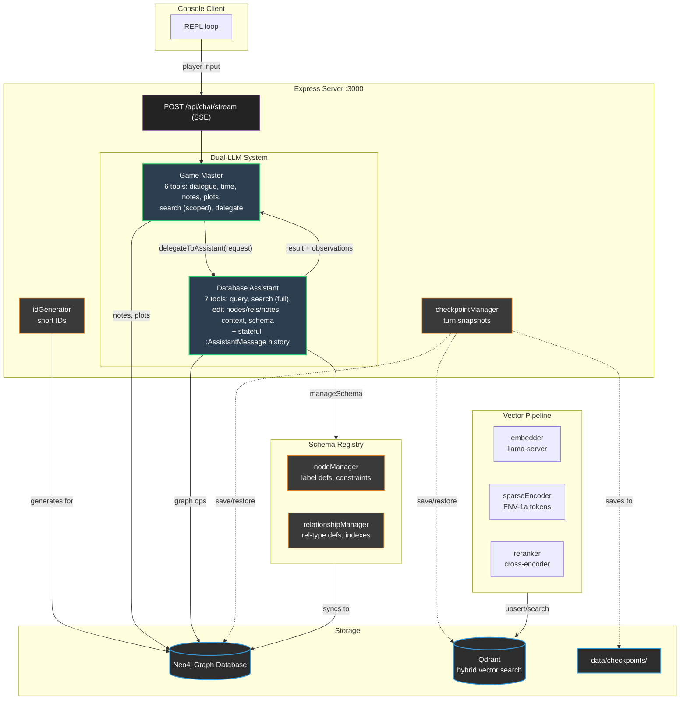

# Developer Documentation: Chorus

**Chorus** is a cinematic dialogue engine — a text-based RPG where an AI Game Master narrates a story, manages world state in a graph database, and responds to player choices with branching dialogue and skill checks.

- **Stack:** TypeScript, Node.js, Express, Neo4j, Qdrant
- **AI:** Dual-LLM — Game Master (narrative) + Database Assistant (graph ops), via Vercel AI SDK
- **Clients:** Console REPL (`npm run console`) and MCP server for editor integration

---

## Architecture



**Flow:** Player input → GM works (delegates DB queries to Assistant, drafts notes/plots) → GM narrates via `generateDialogueStep` → stream stops → Assistant auto-persists world state → SSE streams back.

---

## LLM Tools

GM and Assistant each have their own `streamText` invocation with separate tool sets. The GM delegates all database operations to the Assistant via `delegateToAssistant`.

### GM (6 tools — narrative focus)

| Tool | Purpose |
|---|---|
| `generateDialogueStep` | Speak to the player (messages + options) |
| `advanceTime` | Move the in-game clock |
| `editNote` | CREATE/UPDATE/DELETE scratchpad notes (no linking) |
| `editPlot` | Create and manage plot arcs, branches, flags |
| `searchWorld` | Vector search — scoped to `:Note` and `:Plot` |
| `delegateToAssistant` | Natural-language delegation to Assistant |

### Assistant (7 tools — database focus)

| Tool | Purpose |
|---|---|
| `queryWorld` | Cypher READ/WRITE |
| `searchWorld` | Full vector search across all types |
| `editNode` | Create/update/delete any node (entities, dispositions) |
| `editRelationship` | Create/update/delete relationships |
| `editNote` | Full note CRUD with entity/message/plot linking |
| `getContext` | Scene context, entity briefs, schema dumps |
| `manageSchema` | Register/unregister node and relationship types |

### Turn Lifecycle (TurnStateMachine)

Each turn progresses through phases tracked by `TurnStateMachine` (`src/server/turnState.ts`):
1. **START/GM_DRAFTING/GM_DELEGATING** — GM calls tools freely (delegate to Assistant, edit notes/plots, advance time)
2. **DIALOGUE_SENDING** — GM calls `generateDialogueStep`; stream stops when validation passes
3. **PERSISTING** — Assistant is auto-invoked to persist world state changes
4. **COMPLETE** — Turn finished

Phase changes are emitted as SSE `phase` events for console display.

### Database Assistant

The Assistant is a stateful second LLM with its own message history (`:AssistantMessage` nodes, max 20). It serves two roles:
- **Mid-turn delegation** — GM calls `delegateToAssistant` to query/modify the database. Assistant sees GM tool call names only.
- **Auto-persist** — After dialogue validation, the assistant is automatically invoked with full GM tool call parameters. It inspects the dialogue output and GM activity, then persists world state changes (locations, items, dispositions, plot flags) using its own judgment.

Both use the same `AssistantMessage` stream for continuity within a turn.

Model configured via `ASSISTANT_PROVIDER` / `ASSISTANT_MODEL` env vars; falls back to the GM's model.

---

## Key Concepts

**Graph-native world.** The Neo4j database IS the world. Characters, objects, locations, dispositions, plots, notes, messages, and time are all nodes and relationships. If it's not persisted, it didn't happen.

**Hybrid vector search.** Entities and relationships are embedded into Qdrant via llama-server. Search fuses dense name vectors, dense content vectors, and sparse keyword vectors (FNV-1a hashing) via Reciprocal Rank Fusion, with optional cross-encoder reranking.

**Dynamic schema.** Node labels and relationship types are not hardcoded — `NodeManager` and `RelationshipManager` registries allow the GM to register new types at runtime via `manageSchema`. Property schemas define valid fields, embedding behavior, and index/constraint creation.

**Turn checkpoints.** After each successful turn, the full Neo4j graph and Qdrant collection are snapshotted to `data/checkpoints/`. Restoring a checkpoint rolls back both databases to that turn.

**Skill checks.** 12 inner skills (LOGIC, RHETORIC, EMPATHY, etc.). Checks use 2d6 + stat vs. difficulty, resolved server-side. Results are injected into the GM prompt for narrative integration.

**Seed stories.** World state is bootstrapped from TOML files in `src/server/stories/`. Active story set via `ACTIVE_SEED_STORY`. Seeding is idempotent on restart.

---

## Project Layout

```
src/
├── console/           # Terminal REPL client
├── server/
│   ├── tools/         # All 11 tool implementations (shared by GM + Assistant)
│   ├── assistant/     # Database Assistant LLM (model, prompt, messages, core)
│   ├── gm/            # Game Master LLM
│   ├── memory/        # Neo4j + Qdrant client layer
│   ├── models/        # Domain models (time, entity, plot)
│   ├── stories/       # Seed world TOML files
│   └── turnState.ts   # Turn state machine for phase tracking
├── shared/            # Constants, SSE types, utilities
└── types/             # Frontend dialogue types
tests/
├── unit/              # No-dependency unit tests
├── integration/       # Neo4j-backed tool tests
└── scenarios/         # End-to-end gameplay tests
```
