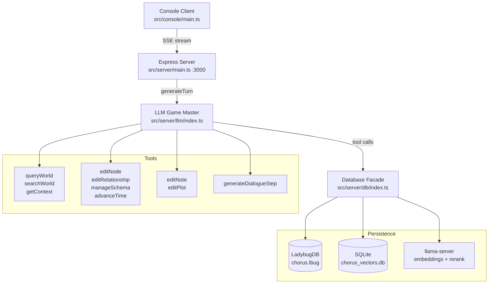

# Chorus — Developer Guide

Cinematic dialogue engine with branching paths, skill checks, and LLM Game Master.
**Stack:** TypeScript, Express, LadybugDB (graph), SQLite (vectors), Vercel AI SDK.

## Files Overview

```
src/
├── console/                          # REPL client
│   ├── main.ts                       # Entry, SSE listener, chalk rendering, REPL loop
│   ├── SseClient.ts                  # SSE stream parser
│   └── markdown.ts                   # Terminal markdown rendering
│
├── server/
│   ├── main.ts                       # Express entry (port 3000)
│   ├── api.ts                        # Routes: /chat/stream, /history, /reset, /checkpoints, /debug/tools/*
│   ├── validation.ts                 # Zod schemas for API input
│   │
│   ├── db/                           # Persistence (LadybugDB + SQLite)
│   │   ├── index.ts                  # Database singleton facade
│   │   ├── ladybug.ts                # LadybugDB client wrapper (Cypher queries)
│   │   ├── vectorstore.ts            # SQLite-backed vector store (brute-force cosine)
│   │   ├── schema.ts                 # SchemaRegistry: node/rel DDL, embedding text, search helpers
│   │   ├── checkpoint.ts             # CheckpointManager: turn-level save/restore (file copy)
│   │   └── models/                   # Domain models
│   │       ├── entities.ts           # EntityModel: Character/Object/Location CRUD + embedding
│   │       ├── plots.ts              # PlotModel: lifecycle, branching, flags
│   │       ├── notes.ts              # NoteModel: GM notes with entity/plot linking
│   │       ├── time.ts               # TimeModel: game time setup + advancement
│   │       └── messages.ts           # MessageModel: conversation, GM turn continuity, options
│   │
│   ├── search/                       # In-process hybrid vector search
│   │   ├── hybridSearch.ts           # 3-way RRF fusion (name dense + content dense + sparse)
│   │   ├── embedder.ts               # llama-server client
│   │   ├── sparseEncoder.ts          # FNV-1a token hashing
│   │   └── reranker.ts               # Optional cross-encoder rerank
│   │
│   ├── llm/                          # Game Master AI
│   │   ├── index.ts                  # generateTurn(): streamText orchestration
│   │   ├── prompt.ts                 # System prompt: toolbox, turn rhythm, memory, plots
│   │   ├── model.ts                  # Provider/model selection via env vars
│   │   ├── events.ts                 # TurnEventEmitter — SSE event emission
│   │   ├── sceneContext.ts           # Builds scene context, entity briefs, plot trees
│   │   ├── conditionEvaluator.ts     # JS expression evaluation for skill checks
│   │   ├── rollSkillCheck.ts         # 2d6 + stat vs difficulty resolution
│   │   └── tools/                    # LLM tool implementations (10 tools)
│   │       ├── queryWorld.ts         # Cypher READ/WRITE
│   │       ├── searchWorld.ts        # Dynamic vector search
│   │       ├── editNode.ts           # Node CRUD
│   │       ├── editRelationship.ts   # Relationship CRUD
│   │       ├── editNote.ts           # Note CRUD + linking
│   │       ├── editPlot.ts           # Plot CRUD + branching
│   │       ├── manageSchema.ts       # Register/unregister node/rel types
│   │       ├── getContext.ts         # Scene context, schema dump, relationship dump
│   │       ├── generateDialogueStep.ts  # Structured narrative output
│   │       ├── advanceTime.ts        # In-game clock advancement
│   │       └── shared.ts             # wrapSafe, extractInternalAndUnknownKeys
│   │
│   └── stories/                      # World seeding (TOML)
│       ├── index.ts                  # Active story selection
│       ├── seed.ts                   # seedDatabase(): idempotent seed via domain models
│       ├── types.ts                  # TOML format types
│       ├── glass-cage.toml           # Default seed story
│       └── magic-awakening.toml      # Alternate seed story
│
├── shared/                           # Shared constants & types
│   ├── constants.ts                  # TOOL_NAMES, SKILL_NAMES, SEGMENT_LABELS
│   ├── events.ts                     # SSE event type definitions
│   ├── sse.ts                        # SSE formatting helpers
│   └── colors.ts                     # Chalk wrappers for console output
│
└── types/                            # Frontend types
    └── dialogue.ts                   # Message, DialogueOption
```

---

## Architecture



---

## LLM Tools

| Category | Tool | Purpose |
|---|---|---|
| **SENSE** | `getContext` | Scene context, entity briefs, plot tree, schema/relationship dump (in-memory) |
| | `searchWorld` | 3-way hybrid vector search across nodes and relationships |
| | `queryWorld` | Cypher READ/WRITE with limited rows |
| **ACT** | `editNode` | Node CRUD with auto-embedding |
| | `editRelationship` | Relationship CRUD with auto-embedding |
| | `manageSchema` | Register/unregister types; generates DDL |
| | `advanceTime` | Advance in-game clock by hours/days |
| **TRACK** | `editNote` | GM scratchpad notes linked to entities, messages, plots |
| | `editPlot` | Plot lifecycle with status transitions, flags, branching |
| **SPEAK** | `generateDialogueStep` | Narrative output + player options |

---

## SSE Events

| Event | Payload | Trigger |
|---|---|---|
| `step_start` | `{ stepId }` | Turn begins |
| `streaming_messages` | `{ messages }` | Progressive during dialogue generation |
| `streaming_reset` | `{}` | LLM retried — discard previous |
| `time_update` | `{ day, segment, segmentsAdvanced }` | `advanceTime` executes |
| `options` | `{ options }` | Options available mid-stream |
| `parsed` | `{ messages, options }` | Final structured output |
| `error` | `{ message }` | Error during generation |
| `done` | `{}` | Turn complete |
| `roll_result` | `{ skill, difficulty, dice[], total, statBonus, success }` | Skill check resolved |

---

## API Endpoints

| Method | Path | Purpose |
|---|---|---|
| `POST` | `/api/chat/stream` | Primary AI turn (SSE) |
| `GET` | `/api/history` | Full conversation history |
| `GET` | `/api/game/current` | Current dialogue options |
| `POST` | `/api/debug/tools/:toolName` | Invoke any GM tool directly |
| `POST` | `/api/reset` | Clear database and re-seed |
| `GET` | `/api/checkpoints` | List saved checkpoints |
| `POST` | `/api/checkpoint/restore/:turn` | Restore to a checkpoint |

---

## Data Files

| File | Purpose |
|---|---|
| `data/chorus.lbug` | LadybugDB graph database |
| `data/chorus_vectors.db` | SQLite vector store |
| `data/checkpoints/` | Turn-level checkpoint snapshots |

---

## Game Time

Minimum unit: 0.5 hours. Day is integer, hour is 0–23.5. Only advances via `advanceTime`. Stored as `TimeAnchor → CURRENT_TIMEPOINT → TimePoint` chain with `NEXT_TIMEPOINT` reason.

---

## Skill Checks

12 skills: LOGIC, RHETORIC, EMPATHY, PERCEPTION, VOLITION, ENDURANCE, SORCERY, SUGGESTION, INSTINCT, MIGHT, CLOCKWORK, ALCHEMY.

**Formula:** `2d6 + Stat >= Difficulty`. Resolved server-side; result injected into GM prompt. Supports conditional outcomes via JS expression evaluation.

---

## Tests

```
tests/
├── helpers.ts                        # setupTestDb, teardownTestDb, getTestDb (stub embedder)
├── unit/
│   ├── schema.test.ts                # SchemaRegistry (14 tests)
│   ├── vectorstore.test.ts           # VectorStore (5 tests)
│   └── hybridSearch.test.ts          # HybridSearcher (3 tests)
└── integration/
    ├── entity-crud.test.ts           # EntityModel CRUD + vectors (6 tests)
    ├── message-model.test.ts         # MessageModel + game state (4 tests)
    ├── note-model.test.ts            # NoteModel CRUD + linking (5 tests)
    ├── plot-model.test.ts           # PlotModel lifecycle + branching (7 tests)
    ├── time-model.test.ts           # TimeModel advancement (4 tests)
    └── checkpoint.test.ts           # CheckpointManager list + restore (2 tests)
```

Run: `npm test` (Vitest, 51 tests, LadybugDB + SQLite run in-process).
